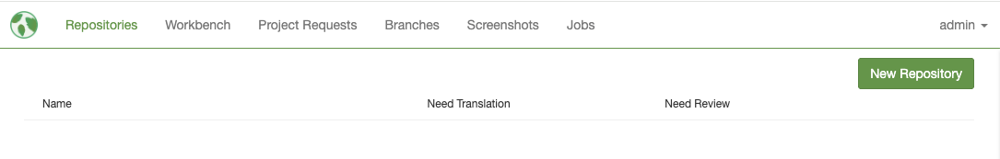
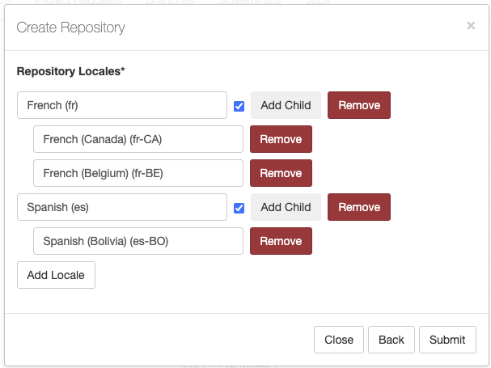
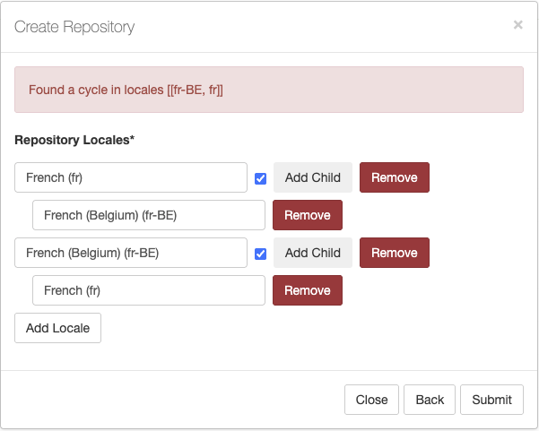
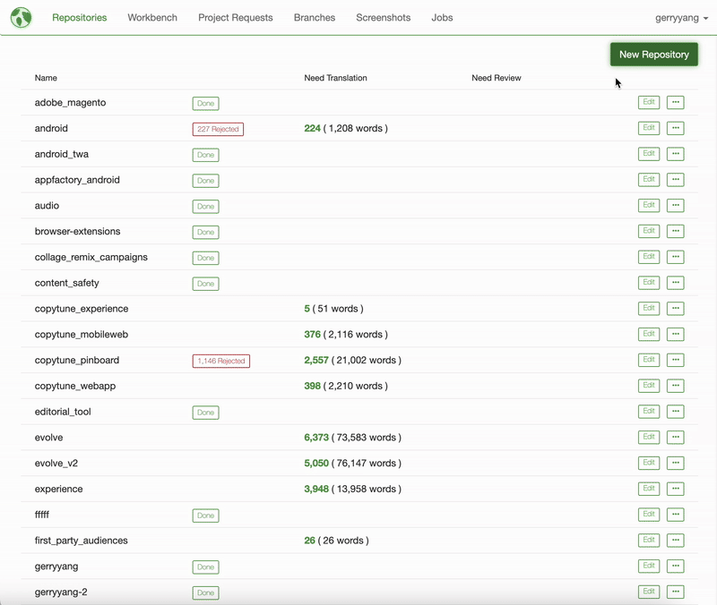
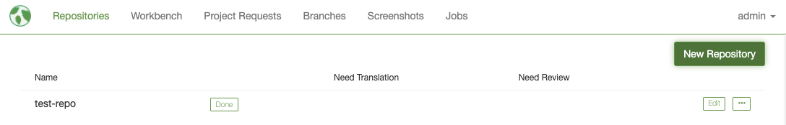

{{ site.mojito_green }} allows you to create and update repositories. A repository is a container for strings and their translations, storing localization configurations such as locales and integrity checkers.

## Creating Repository

Click on the **New Repository** button and fill out the following fields:

- **Name of Repository**: Enter the repository name
- **Description of Repository** (Optional): Add a description for the repository
- **Source Locale**: The original language of your application's strings (typically English). This is the language you are translating from
- **Check SLA** (Optional): Enable alerting if translations have taken longer than 24 / 48 hours to come back from Smartling. This feature is currently disabled
- **Asset Integrity Checker** (Optional): This is a string in the format `fileExtension1 : integrityCheckerType1, fileExtension2: integrityCheckerType2...`. See [Integrity Checkers]({{ site.url }}/docs/guides/integrity-checkers/) for more information
- **Repository Locales**: The target languages you want to translate your strings into. You can also set up parent and child locales, where child locales inherit translations from their parent locales. See [Managing Locales]({{ site.url }}/docs/guides/managing-locales/) for more information

### Repository Locales Example

In the above Repository Locales example, `fr` and `es` are parent locales. `fr-CA` and `fr-BE` inherit translations from `fr`. `es-BO` inherits translations from `es`.

### Repository Locales Cycle Example

In the above Repository Locales example, `fr` and `fr-BE` are parent locales. `fr-BE` inherits translations from `fr`. `fr` inherits translations from `fr-BE`. This creates a cycle, because `fr` is the parent of `fr-BE` which is the parent of `fr`. This is an invalid configuration.

## Video Walkthrough

## Updating Repository

Click the `Edit` button next to any repository to modify its settings. The same modal will open with the repository's values pre-filled, allowing you to update any field except the source locale.