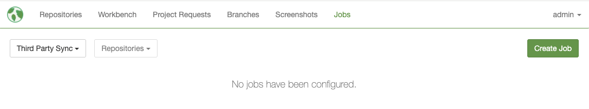
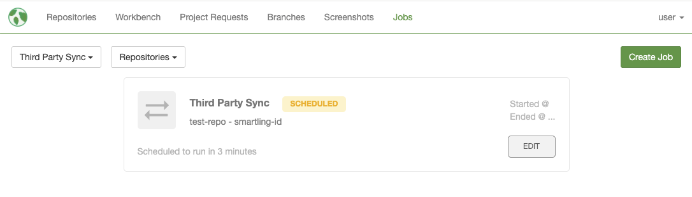

Scheduled jobs automatically sync source strings and translations between Mojito and third-party translation providers like Smartling. This guide shows you how to create and update these scheduled jobs jobs.

## Creating a Scheduled Job

1. Navigate to the **Jobs** page
2. Click the **Create Job** button
3. Configure the following settings:

### Required Fields

- **Repository**: Select the repository to sync
- **Job Type**: Choose between "Third Party Sync" or "Evolve Sync"
- **Cron Expression**: Set how often the job runs (preset options or custom cron)
- **Third Party Project ID**: Enter your project ID from the translation provider

### Sync Actions

Configure which operations the job should perform:

- **Push**: Send source strings to the third-party provider
- **Pull**: Retrieve translations from the third-party provider  
- **Map Text Unit**: Create links between Mojito and third-party text units
- **Push Screenshot**: Send screenshots from Mojito to the third-party provider
- **Push AI Translation**: Send AI-generated translations (enable only if requested by i18n team)

> **Recommended**: Enable Push, Pull, Map Text Unit, and Push Screenshot.

### Advanced Settings

- **Locale Mapping**: Map different locale codes between Mojito and the provider
- **Plural Separator**: Default is `_` - separates text units from their plural forms
- **Skip Text Unit With Pattern**: Exclude text units matching specific patterns
- **Skip Assets with Path Pattern**: Exclude assets matching path patterns
- **Include Text Units with Pattern**: Only include text units matching patterns
- **Smartling Placeholder Format**: Set to `NONE` for custom placeholders, or `JAVA`

## Video Walkthrough

## Editing Scheduled Jobs

Click the `Edit` button next to any scheduled job to modify its settings. The same modal will open with the scheduled job's values pre-filled, allowing you to update its fields.