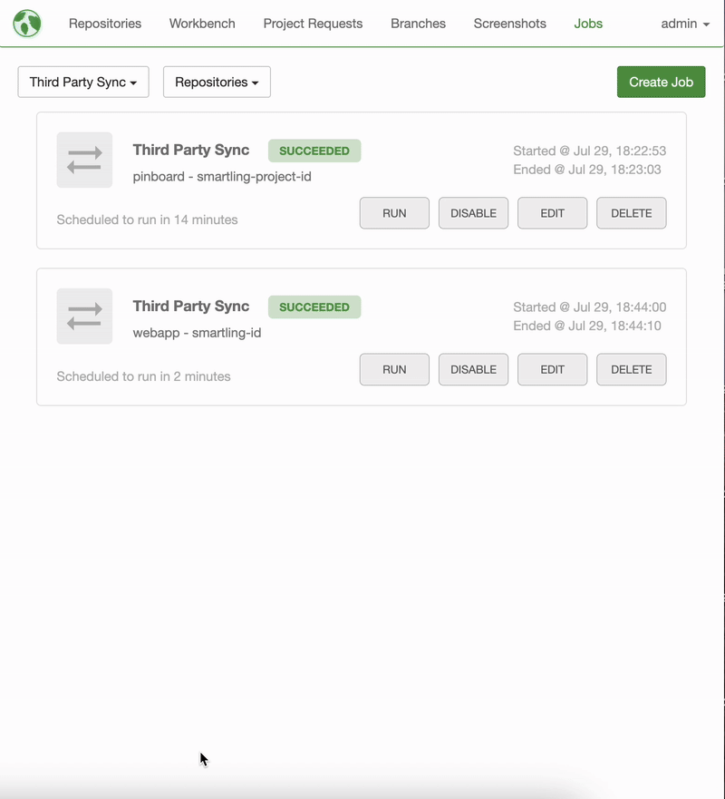

In this guide, we will walk through how to configure scheduled jobs in {{ site.mojito_green }} directly from the Mojito platform. Scheduled jobs sync source strings and their translations between Mojito and Smartling, 

